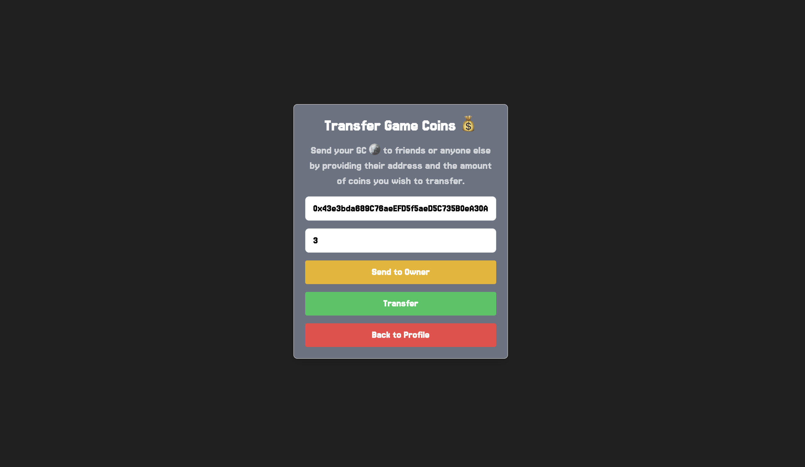

# Game Coin DApp 🎮💰
The Game Coin App is a decentralized application (dApp) built on Ethereum blockchain that allows users to manage their game currency with ease. It provides functionalities for user authentication, buying and selling game coins, transferring game coins to others, and more.

## Technologies Used 💻
- **Frontend:** React.js ⚛️
- **Styling:** Tailwind CSS 🎨
- **Smart Contracts:** Solidity 🔐
- **Ethereum Blockchain:** ERC20 Token Standard ⛓️
  
## Features 🎉
- **User Authentication:** Users can register, login, and view their profile.
- **Buying and Selling Game Coins:** Users can buy game coins using Ethereum and sell game coins to receive Ethereum.
- **Transferring Game Coins:** Users can transfer game coins to others by providing the recipient's address and the amount of coins to transfer.

## Smart Contracts 🧠
The project utilizes two smart contracts:
- **Authentication Contract:** Manages user registration, login, and profile information.
- **Game Coin Contract (ERC20 Token):** Implements the ERC20 token standard for managing game coins.

## Getting Started 🚀
1. Clone the Repository:
```bash
git clone https://github.com/mutasim77/game-coin-dapp.git
cd game-coin-dapp
```
2. Install dependencies using `yarn`
3. Deploy Smart Contracts:
     - Open [Remix](https://remix.ethereum.org/).
     - Copy the smart contract code from the [contracts directory](./contracts/) and paste it into Remix.
     - Compile and deploy the ProfileContract and GameCoinContract on the Ethereum network.
     - Save the deployed contract addresses.
4. Configure Environment Variables:  
     - Create a `.env` file in the `client` directory.
     - Add the following variables with your deployed contract addresses:
        ```js
        VITE_AUTH_CONTRACT_ADDRESS=<Your_Auth_Contract_Address>
        VITE_GAME_CONTRACT_ADDRESS=<Your_Game_Contract_Address>
        ```
5. Start the frontend server using `yarn dev`
6. Setup Ethereum Wallet:
   - Ensure you have an Ethereum wallet (e.g., MetaMask) installed to interact with the application on the Ethereum blockchain.

## How to Use 📚
- Register or login to your account.
- Navigate to the profile page to view your information.
- Buy game coins by specifying the amount and confirming the transaction.
- Sell game coins by specifying the amount and confirming the transaction.
- Transfer game coins to others by providing the recipient's address and the amount of coins to transfer.

## Preview of Screenshots 🖼️




## 🏁 Conclusion
Thank you for exploring the Game Coin DApp! Your feedback and contributions are highly appreciated. 

Happy gaming! ❤️
